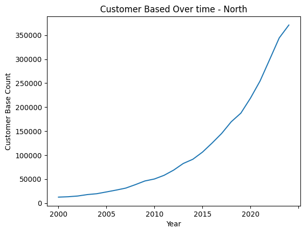
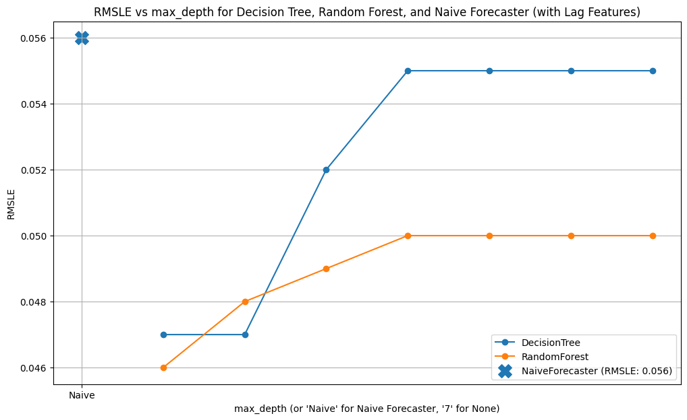

# 📈 E-commerce Customer Growth Forecasting

### Machine Learning & Time Series Analysis Project

## 🚀 Overview

Forecasting customer growth is a critical challenge for e-commerce businesses aiming to scale efficiently. In this project, I developed machine learning models to predict future customer growth using historical data from **2000 to 2024**.

The project combines **time series analysis, feature engineering, and predictive modeling** to generate actionable business insights that support strategic decision-making.

---

## ❗ Business Problem

E-commerce companies must anticipate customer growth to:

* Optimize marketing campaigns
* Plan infrastructure and operations
* Forecast revenue and demand
* Scale efficiently without over/under-investment

However, growth patterns are often **non-linear**, influenced by trends, seasonality, and external factors—making accurate forecasting complex.

---

## 🎯 Project Objectives

* Analyze historical customer growth trends
* Engineer meaningful time-based features
* Build and compare forecasting models
* Evaluate performance using robust metrics
* Provide data-driven business insights

---

## 📊 Dataset

* **Source:** Simulated E-commerce Customer Dataset
* **Time Range:** 2000 – 2024
* **Target Variable:** Total Customers

### Features:

* Year
* Total Customers

### Engineered Features:

* Year-over-Year Growth (YoY)
* Lag Features (t-1, t-2, …)
* Rolling Averages
* Growth Rate Transformations

---

## 🧠 Methodology

### 🔹 1. Data Preprocessing

* Structured time series format
* Handled missing values
* Generated temporal features

### 🔹 2. Exploratory Data Analysis (EDA)

* Trend visualization over time
* Growth rate analysis
* Identification of long-term patterns

### 🔹 3. Feature Engineering

* Lag-based features for temporal dependency
* Rolling statistics for smoothing trends
* Growth-based transformations

### 🔹 4. Modeling

Implemented and compared:

* ✅ Naive Baseline Model
* 🌳 Decision Tree Regressor
* 🔮 (Future Scope: Random Forest, XGBoost, LSTM)

### 🔹 5. Evaluation Metrics

* RMSE (Root Mean Squared Error)
* MAE (Mean Absolute Error)
* RMSLE (Root Mean Squared Log Error)

---

## 📈 Results & Insights

* Strong upward trend in customer growth identified
* Machine learning models significantly outperformed baseline
* Decision Tree captured **non-linear growth patterns effectively**
* Forecast suggests continued expansion of the customer base

💡 **Key Business Insight:**
The company can confidently plan for **sustained growth**, enabling better investment in marketing, infrastructure, and scaling strategies.

---
## 📊 Visualizations

### Customer Growth Trend


### Forecast vs Actual


### Model Comparison

---

## ⚙️ Installation & Setup

### 1️⃣ Clone the Repository

```bash
git clone https://github.com/Muradamen/ecommerce-customer-growth-forecasting-ml.git
cd ecommerce-customer-growth-forecasting-ml
```

### 2️⃣ Install Dependencies

```bash
pip install -r requirements.txt
```

### 3️⃣ Run the Notebook

```bash
jupyter notebook
```

---

## 📂 Project Structure

```
ecommerce-customer-growth-forecasting-ml/
│
├── data/                # Dataset
├── notebooks/          # Jupyter notebooks
├── images/             # Visualizations
├── src/                # (Optional) modular code
├── requirements.txt
└── README.md
```

---

## 🔮 Future Improvements

* Implement advanced models (XGBoost, Prophet, LSTM)
* Add external variables (marketing spend, seasonality)
* Perform time-series cross-validation
* Forecast next 5–10 years
* Deploy interactive dashboard using Streamlit
* Build REST API for real-time predictions

---

## 💼 Skills Demonstrated

* Time Series Forecasting
* Machine Learning Modeling
* Feature Engineering
* Data Analysis & Visualization
* Model Evaluation & Optimization
* Business Insight Generation

---

## 👨‍💻 Author

**Murad Amin**

* 🔗 GitHub: [https://github.com/Muradamen](https://github.com/Muradamen)
* 🔗 LinkedIn: [https://www.linkedin.com/in/muradamin](https://www.linkedin.com/in/muradamin)

---
👉 Share your project on GitHub and LinkedIn using the hashtag:
#ALXProjectPortfolio
## ⭐ Support

If you found this project useful or interesting, consider giving it a ⭐ on GitHub!


